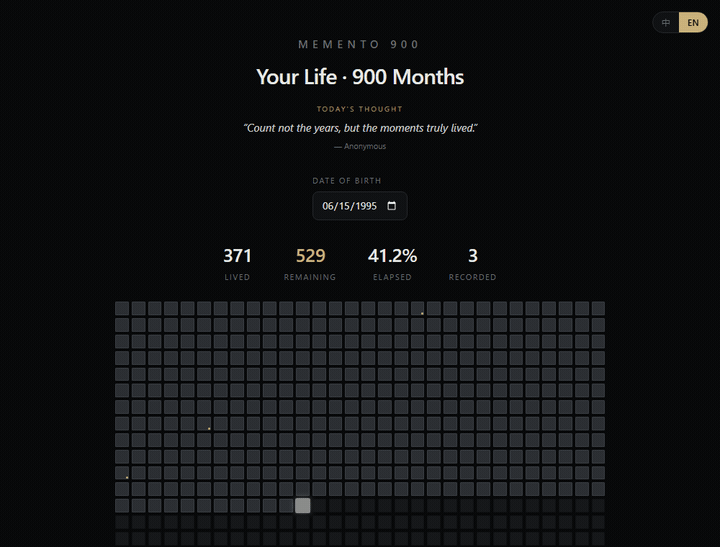
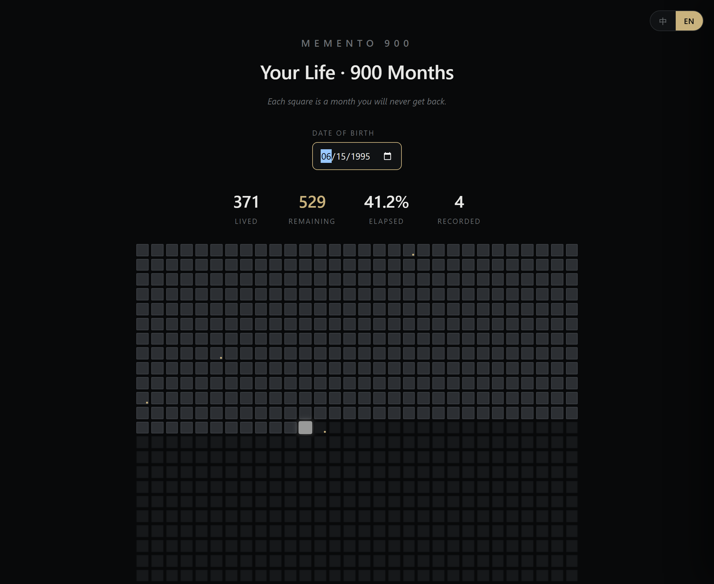
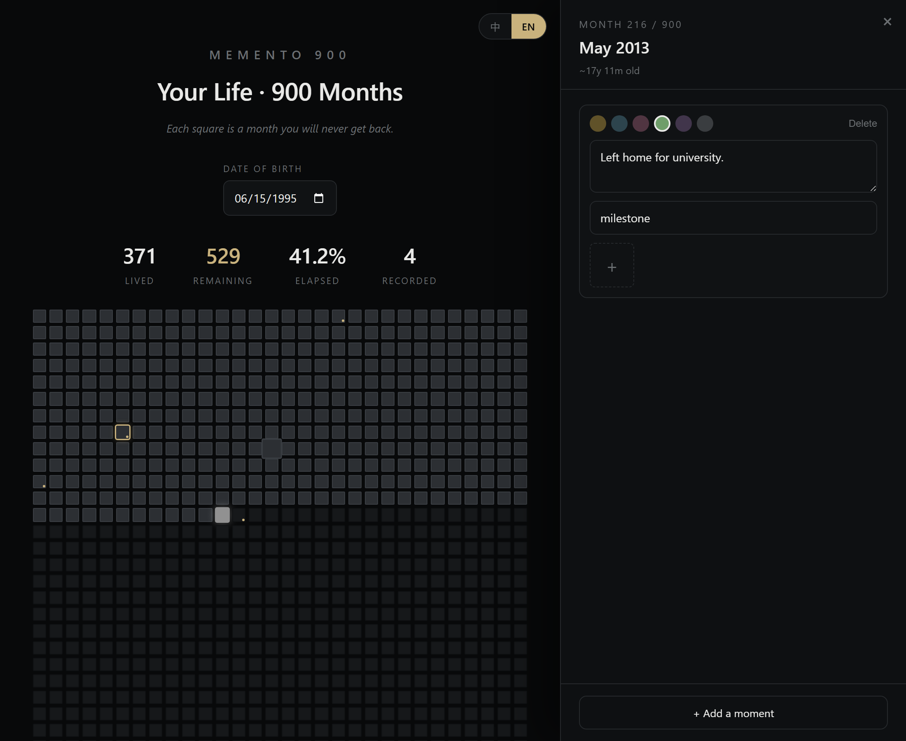

<div align="center">

# Memento 900

### 900 months, one grid.

A privacy-first, local-first life tracker. Visualize your entire life as a
**30 × 30 grid of 900 months** — and remember that your time is finite.

*Inspired by the "life in months" idea: a single life, drawn as 900 squares.*

**English** · [简体中文](README.zh.md)

<br />



<br />



<br />



</div>

---

## Why

We tell ourselves we have plenty of time. Memento 900 quietly disagrees.
Each square is one month of a ~75-year life. The months you've lived are
dimmed; the one you're in now glows; the rest are waiting. Every month, one
more square turns to the past — a gentle, recurring reminder to spend the
time well.

It is **not** designed to keep you in the app. You glance at it, and then you
go live. No streaks-as-anxiety, no engagement traps, no nagging.

## Features

- 🗓️ **The 900-month grid** — your whole life at a glance, computed precisely
  from your date of birth (anniversary-accurate, leap-year safe).
- 📝 **Record any month** — capture multiple "moments" per month with a note,
  a mood, tags, and photos.
- 🔍 **Search** — full-text search across every recorded moment (text, tags,
  mood), with mood filters, match highlighting, and click-to-jump.
- 🔭 **Life Lens** — an interactive way to *feel* the time you have left:
  weekends, seasons, birthdays and full moons remaining, plus a live calculator
  ("if I do this N times a year…" — including "how many times will I see my
  parents"). Works instantly, no records needed.
- 🔒 **Private & local-first** — all data lives in a local SQLite file on your
  device. No account, no server, no cloud, no tracking.
- 🌐 **Bilingual** — English / 简体中文, switchable anytime.
- 🪶 **Tiny** — ~1.7 MB installer, ~27 MB RAM. Built with Tauri 2, not Electron.

## Try it now

▶️ **[Live demo](https://dtneverland.github.io/memento-900/)** — runs in your
browser, no install. (Browser data stays in your browser; the desktop app uses
a local SQLite file.)

## Download

Grab the latest installer from the
**[Releases page](../../releases/latest)** →
`Memento 900_x.y.z_x64-setup.exe` (Windows 64-bit).

Your data is stored at:
`%APPDATA%\com.memento900.app\memento900.db`
To move to a new machine, copy that file over.

## Tech

| Layer | Choice |
|-------|--------|
| Shell | [Tauri 2](https://tauri.app) (Rust) |
| UI | React 18 + TypeScript + Tailwind CSS |
| Storage | SQLite (`tauri-plugin-sql`) |
| Animation | Framer Motion |
| Tests | Vitest (the date→month engine is fully unit-tested) |

## Develop

```bash
npm install
npm run dev          # browser dev (localStorage backend)
npm test             # run the time-engine unit tests
npm run tauri dev    # run the desktop app (SQLite backend)
```

### Build the installer (Windows)

Requires Rust + MSVC Build Tools. Then:

```bash
npm run tauri build
```

The installer is emitted to
`src-tauri/target/release/bundle/nsis/`.

### Cut a release (Windows)

Double-click **`release.bat`** (or run it in a terminal). It asks for the new
version and a one-line changelog, then bumps the version everywhere, runs the
tests, commits & pushes, builds the installer, and publishes a GitHub Release —
all in one go.

## License

[MIT](LICENSE) — do what you like, keep the notice.

---

<div align="center">
<sub>Remember you have but 900 months. Spend them well.</sub>
</div>
